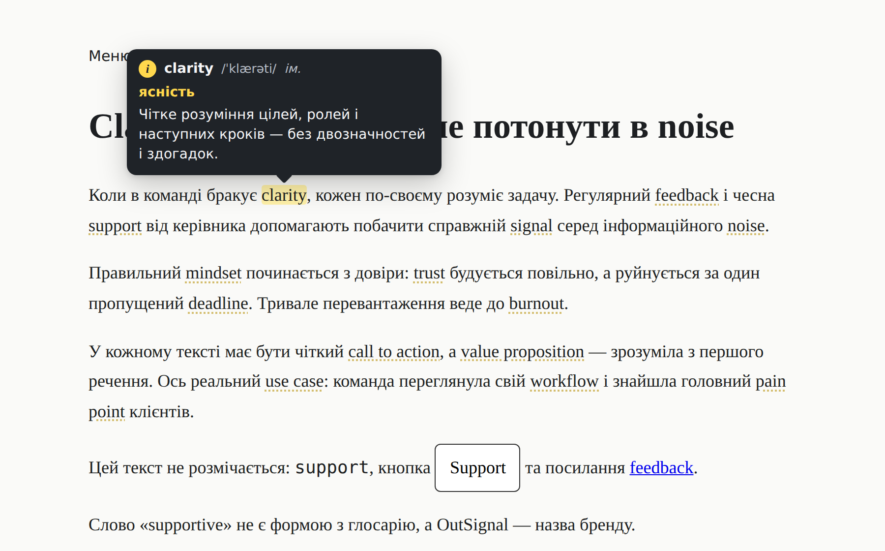

# OutSignal Glossary — подсказки для английских терминов в статьях

Когда в тексте статьи встречается английский термин (`clarity`, `support`, `call to action`…),
он получает тонкое пунктирное подчёркивание. При наведении слово подсвечивается жёлтым,
а над ним появляется плашка со значком ⓘ: термин, транскрипция, перевод и одна фраза
о том, в каком значении слово используется.



## Что внутри

| Файл | Назначение |
|---|---|
| `glossary/outsignal-glossary.js` | Скрипт, ~9 КБ, без зависимостей |
| `glossary/outsignal-glossary.css` | Стили термина и плашки (цвета — CSS-переменные) |
| `glossary/glossary.json` | Словарь: термин, словоформы, транскрипция, перевод и пояснение на `uk` и `ru` |
| `tools/inject-jsonld.mjs` | Статическая вставка JSON-LD в HTML (необязательно) |
| `integrations/wordpress/outsignal-glossary.php` | Готовый mu-plugin для WordPress |
| `demo/` | Демо-страницы (`index.html` — украинский, `ru.html` — русский) |
| `tests/` | Браузерные тесты (Playwright) |

## Подключение

### Любой сайт

```html
<link rel="stylesheet" href="/glossary/outsignal-glossary.css">
<script src="/glossary/outsignal-glossary.js" data-src="/glossary/glossary.json" defer></script>
```

### WordPress

1. `integrations/wordpress/outsignal-glossary.php` → `wp-content/mu-plugins/`
2. Папку `glossary/` → `wp-content/mu-plugins/outsignal-glossary/`

Скрипт подключится только на страницах записей.

### Настройки

Через атрибуты `data-*` на теге `<script>` или объект `window.OutSignalGlossaryConfig`:

| Параметр | По умолчанию | Что делает |
|---|---|---|
| `src` | `/glossary/glossary.json` | Адрес словаря |
| `scope` | `.entry-content, .post-content, article…` | Где искать термины (только тело статьи) |
| `skip` | ссылки, кнопки, `code`, заголовки, меню… | Где не размечать. Можно отключить блок атрибутом `data-no-glossary` |
| `lang` | из `<html lang>` | Язык подсказок (`uk` / `ru`) |
| `firstOnly` | `false` | Размечать только первое вхождение термина в статье |
| `jsonLd` | `true` | Добавлять разметку `schema.org` |
| `external` | `false` | Брать определения из внешнего словаря для слов, которых нет в `glossary.json` |
| `lookup` | — | Своя функция поиска определения (для своего API / прокси) |

Для динамически подгруженного блока: `OutSignalGlossary.scan(element)`.

## Как пополнять словарь

```json
{
  "id": "clarity",
  "term": "clarity",
  "forms": ["clarities"],
  "pos": "noun",
  "ipa": "ˈklærəti",
  "uk": { "t": "ясність", "d": "Чітке розуміння цілей, ролей і наступних кроків." },
  "ru": { "t": "ясность", "d": "Чёткое понимание целей, ролей и следующих шагов." }
}
```

- `t` — перевод (жёлтая строка в плашке), `d` — краткое пояснение контекста.
- `forms` — словоформы и сокращения (`supported`, `CTA`). Регистр не важен.
- Фразы из нескольких слов имеют приоритет над отдельными словами.
- `ignore` в корне словаря — бренды и названия, которые не нужно размечать.

**Пояснение для конкретной статьи** — если в статье слово используется в особом значении,
добавьте в её HTML (без правки текста):

```html
<script type="application/json" data-os-glossary>
  {"terms":[{"id":"clarity","ru":{"t":"ясность","d":"Здесь — ясность ожиданий клиента."}}]}
</script>
```

## SEO

- **Текст статьи не меняется.** В CMS остаётся чистый текст, разметка `<span class="os-term" lang="en">`
  появляется только в браузере.
- **`lang="en"`** на каждом термине: поисковик и экранный диктор понимают, что это английское слово.
- **JSON-LD `DefinedTermSet` / `DefinedTerm`** в `<head>` — определения терминов, найденных
  на странице, в формате `schema.org`. Google выполняет JavaScript и видит эту разметку;
  для гарантии её можно положить в HTML статически:
  ```bash
  node tools/inject-jsonld.mjs glossary/glossary.json public/**/*.html --base https://outsignal.com
  ```
  Тогда браузерный скрипт повторно её не добавляет.
- `DefinedTerm` — семантическая разметка: она не даёт отдельного расширенного сниппета в выдаче,
  но помогает поисковику понять тематику и терминологию страницы.

### Почему не `<dfn>`, `<abbr>` или `title`

- `<dfn>` по стандарту ставится там, где термин **определяется в самом тексте**. У нас определения
  в тексте нет — это было бы неправильное использование тега.
- `<abbr title="…">` — только для аббревиатур (`CTA`, `SEO`).
- `title` показывает системную подсказку с задержкой, без оформления, не работает на телефонах
  и с клавиатуры.

## Внешние словари

- **Apple Dictionary** — открытого веб-API нет, подключить на сайт нельзя.
- **American Heritage Dictionary** — доступен через Wordnik API по ключу. Ключ нельзя держать
  в браузере, нужен небольшой серверный прокси, который подключается через параметр `lookup`.
- **Free Dictionary API** (`dictionaryapi.dev`) — бесплатный, без ключа; включается `external: true`.
  Даёт только английское определение без перевода и без контекста статьи, поэтому
  основной источник — свой `glossary.json`.

## Доступность

- Наведение мышью, фокус с клавиатуры (`Tab`), тап на телефоне, закрытие по `Esc`.
- Плашка связана с термином через `aria-describedby`, на плашку можно навести курсор,
  она не исчезает сразу.
- Плашка не выходит за края экрана и переворачивается вниз, если сверху нет места.
- Тёмная тема, `prefers-reduced-motion`, при печати подсказки скрыты.

## Тесты

```bash
npm install
npm test        # 10 браузерных тестов
npm run demo    # демо на http://localhost:5173/demo/
```
